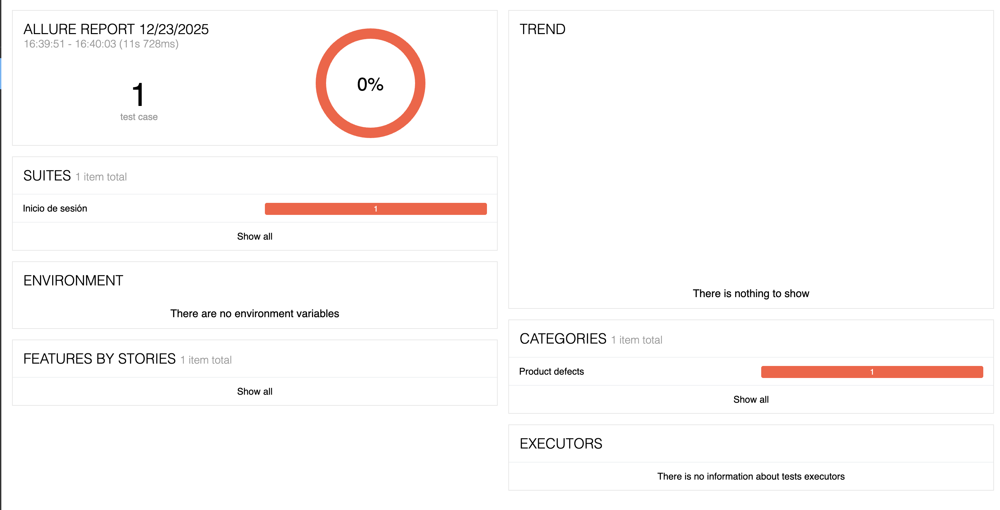
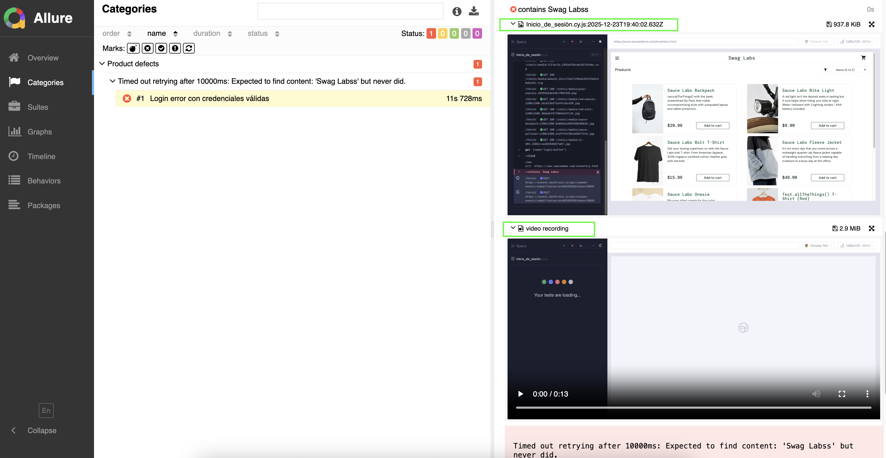
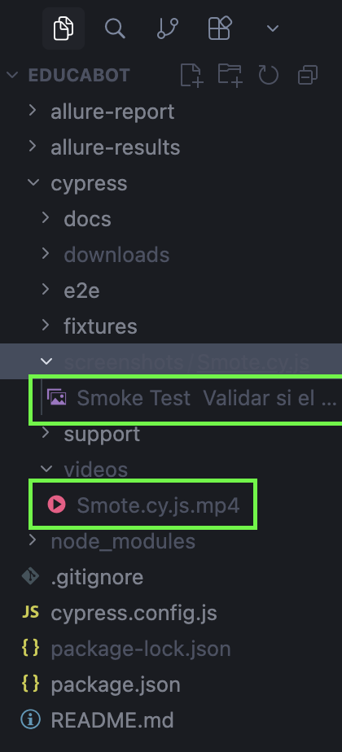

# 1.- Pruebas Automatizadas Educabot 🤖

Bienvenidos al script desarrollado para el equipo de Educabot.

El presente documento tiene como objetivo proporcionar una guía técnica y estructurada para abordar las tareas y desafíos planteados en la prueba técnica. Para esta implementación se realizarán pruebas manuales y automatizadas, enfocadas en la validación funcional, la detección temprana de defectos y la resolución de incidencias de software.

El script ha sido diseñado bajo buenas prácticas de automatización, priorizando la eficiencia, la mantenibilidad y la escalabilidad, con el fin de facilitar su integración y reutilización en futuros flujos de trabajo. Asimismo, busca promover una colaboración efectiva con los distintos equipos involucrados en el proceso de desarrollo y aseguramiento de la calidad.

Avancemos con un enfoque técnico sólido para garantizar la correcta ejecución de cada tarea y el éxito de los objetivos propuestos.Bienvenidos al script diseñado especialmente para el equipo de Educabot.

# 2.- Como Clonar Repositorio 🔧

Abrimos Consola y Colocamos

git init

git clone https://github.com/GangosoO/Educabot-POM-AllureReport.git

# 3.- Instalar dependencias del Script 📝

1 - Arrastramos carpeta Educabot al gestor de Codigo

2 - Reinstalamos Cypress en la consola del gestor de Codigo

npm install cypress --save-dev

## 📝 Scripts Disponibles

- `npm run cypress:open` - Abre la interfaz gráfica de Cypress
- `npm run cypress:run` - Ejecuta las pruebas en modo headless
- `npm run cypress:run:headed` - Ejecuta las pruebas con interfaz gráfica
- `npm test` - Alias para `cypress:open`
- `npm run test-all` - Ejecuta todas las pruebas
- `npm run test-Login` - Ejecuta pruebas de inicio de sesión
- `npm run test-Carrito` - Ejecuta pruebas del carrito de compras
- `npm run test-api` - Ejecuta pruebas de API
- `npm run test-smoke` - Ejecuta pruebas de smoke
- `npm run test-regression` - Ejecuta pruebas de regresión
- `npm run allure:generate` - Genera el reporte de Allure
- `npm run allure:open` - Abre el reporte de Allure
- `npm run allure:report` - Genera y abre el reporte de Allure
- `npm run clean` - Limpia los resultados de Allure

## 📁 Estructura del Proyecto

```
Educabot/
├── cypress/
│   ├── docs/                          # Documentación del proyecto
│   │   ├── API y Ejemplos.pdf
│   |   ├── Bug.pdf  
│   │   ├── Carrito de compras.pdf
│   │   └── Inicio de sesion.pdf
|   |   └── test Plan.pdf
│   ├── e2e/                           # Pruebas end-to-end
│   │   ├── api/                       # Pruebas de API
│   │   │   ├── mercadoLibre.cy.js
│   │   │   └── sauceDemo.cy.js
│   │   ├── Regression/                # Pruebas de regresión
│   │   │   └── Regression.cy.js
│   │   ├── Smoke/                     # Pruebas de smoke
│   │   │   └── Smote.cy.js
│   │   └── UI/                        # Pruebas de interfaz de usuario
│   │       ├── Carrito_de_compras.cy.js
│   │       └── Inicio_de_sesión.cy.js
│   ├── fixtures/                      # Datos de prueba
│   │   └── example.json
│   └── support/                       # Archivos de soporte
│       ├── commands.js                # Comandos personalizados
│       ├── e2e.js                     # Configuración E2E
│       └── POM/                       # Page Object Model
│           ├── Carrito.de.compras.js
│           └── Log.ing.js
├── allure-report/                     # Reportes generados de Allure
├── allure-results/                    # Resultados de las pruebas (Allure)
├── cypress.config.js                  # Configuración de Cypress
├── package.json
└── README.md
```

## 🧪 Comando pare ejecutar correctamente el Reporte allure

1 - Ingresar antes de cada Prueba completa

- `npm run clean` 

2 - Ingresar comando de prueba que se ajusted a tu necesidad 

- `npm run test-smoke`

3 - Ingresar comando despues que termine la ejecucion de las pruebas

- ``npm run allure:report``




## 🧾 Evidencia Despues de Ejecutar Allure

 La estructura contempla, para evidencia:

- Videos

- Screenshots



## ⚙️ Configuración

La configuración de Cypress se encuentra en `cypress.config.js`. Puedes modificar:
- `baseUrl`: URL base de tu aplicación
- `viewportWidth` y `viewportHeight`: Tamaño de la ventana
- `defaultCommandTimeout`: Tiempo de espera por defecto

## 📚 Recursos

- [Documentación oficial de Cypress](https://docs.cypress.io/)
- [Guía de mejores prácticas](https://docs.cypress.io/guides/references/best-practices)
- [API de comandos](https://docs.cypress.io/api/commands)
- [Allure Plugin](https://github.com/Shelex/cypress-allure-plugin-example)

## 🎯 Próximos Pasos

1. Ejecuta las pruebas usando los scripts disponibles: `npm run test-smoke`, `npm run test-regression`, etc.
2. Crea nuevos Page Objects en `cypress/support/POM/` siguiendo el patrón existente
3. Ajusta la configuración en `cypress.config.js` según tus necesidades
